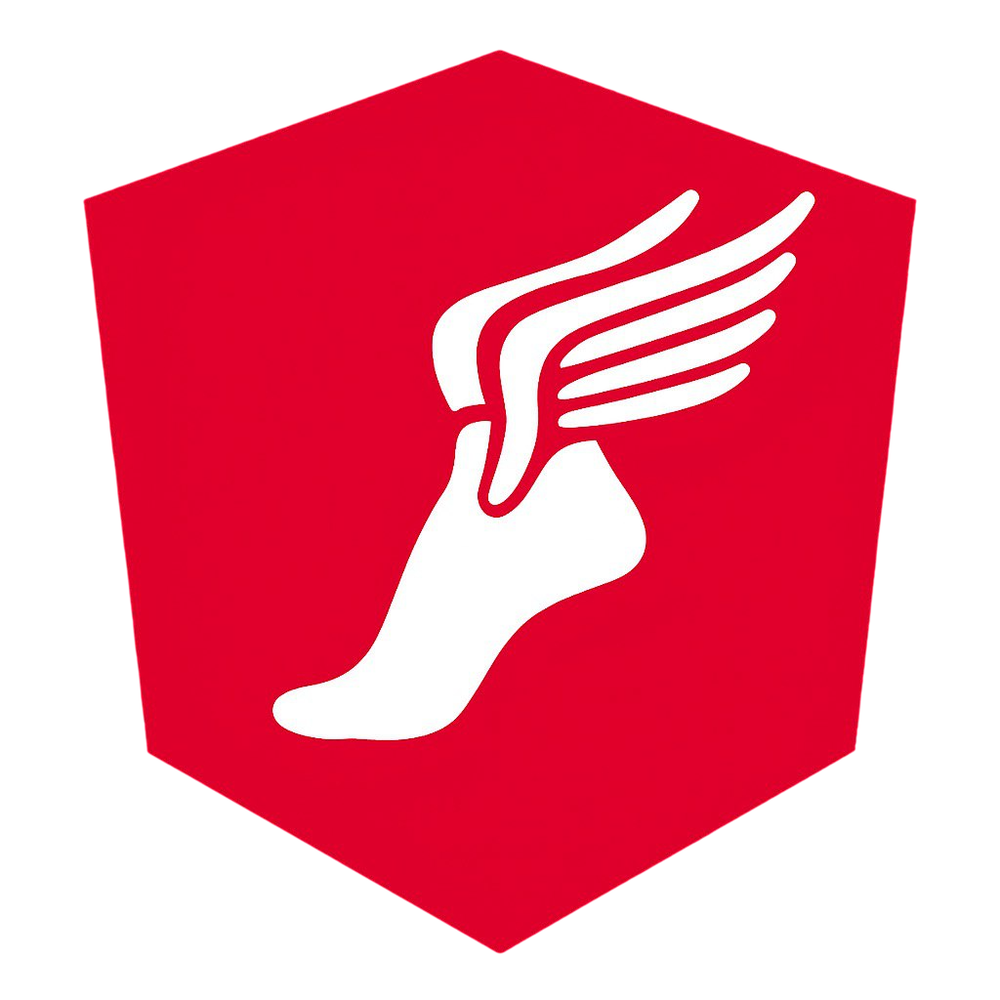

<p align="center">
  
</p>

<h1 align="center">Hermes</h1>

<p align="center">
  Kafka-inspired frontend messaging library for Angular and TypeScript applications.
</p>

## Overview

Hermes is a topic-based frontend communication library inspired by distributed messaging systems such as Kafka.

It provides a structured publish–subscribe architecture for modern frontend applications, allowing components, services, and browser tabs to exchange messages in a decoupled and scalable way.

## Features

- Topic-based communication
- Strongly typed topics
- RxJS-powered streams
- Automatic lifecycle management
- Wildcard subscriptions
- Replay support
- Cross-tab communication
- Browser-tab leader election
- Shared WebSocket management
- Message deduplication
- Angular integration

> **IMPORTANT:** <br>
> I left an API key in the demo for the socket connection, so you don't have to get one. This key was created for testing purposes only, using a TempMail account, and is linked to a free socket server with limits, so spam it and enjoy it as much as you want while it's still working.

## Installation

```bash
npm install hermes
```

## Basic Concept

Hermes uses a topic-based communication model.

Instead of directly connecting components to each other, one part of the application publishes a message to a topic, and any other part of the application can subscribe to that topic.

```txt
  Component A → publish("counter") → HermesBus → subscribe("counter") → Component B
```

This keeps components decoupled and makes the communication flow easier to understand and maintain.

## Defining Topics

Create a topic map to describe the available topics and their payload types.

```ts
export type AppTopics = {
  counter: { value: number };
  'chat.created': { text: string; createdAt: number };
  'chat.updated': { text: string; updatedAt: number };
  'socket.orders': { data: string };
};
```

This allows Hermes to provide type safety when publishing and subscribing.

## Angular Setup

Configure Hermes once at application startup.

```ts
import { ApplicationConfig } from '@angular/core';
import { provideRouter } from '@angular/router';
import { provideHermes } from 'hermes';
import type { AppTopics } from './app-topics';

export const appConfig: ApplicationConfig = {
  providers: [
    provideRouter([]),

    ...provideHermes<AppTopics>({
      topics: {
        counter: {
          replay: 1,
          crossTab: false,
          dedupeByMessageId: true,
        },
        'socket.orders': {
          replay: 50,
          crossTab: true,
          dedupeByMessageId: true,
        },
      },
      crossTab: {
        enabled: true,
        channelName: 'hermes-bus',
      },
    }),
  ],
};
```

## Publishing Messages

```ts
import { Component, inject } from '@angular/core';
import { HERMES_BUS } from 'hermes';
import type { HermesBus } from 'hermes';
import type { AppTopics } from './app-topics';

@Component({
  selector: 'app-counter-producer',
  template: ` <button (click)="increment()">Increment</button> `,
})
export class CounterProducerComponent {
  private readonly bus = inject(HERMES_BUS) as HermesBus<AppTopics>;

  private counter = 0;

  increment(): void {
    this.counter++;

    this.bus.publish('counter', {
      value: this.counter,
    });
  }
}
```

## Subscribing to Topics

```ts
import { Component, inject } from '@angular/core';
import { HERMES_BUS, createAngularScope } from 'hermes';
import type { HermesBus } from 'hermes';
import type { AppTopics } from './app-topics';

@Component({
  selector: 'app-counter-consumer',
  template: ` <p>Counter: {{ counter }}</p> `,
})
export class CounterConsumerComponent {
  private readonly bus = inject(HERMES_BUS) as HermesBus<AppTopics>;
  private readonly scope = createAngularScope();

  counter = 0;

  constructor() {
    this.bus.subscribe(
      'counter',
      (payload) => {
        this.counter = payload.value;
      },
      { scope: this.scope },
    );
  }
}
```

## Lifecycle Management

Hermes uses scopes to manage subscription cleanup.

Instead of manually storing subscriptions and calling unsubscribe(), subscriptions can be attached to a scope.

```ts
const scope = bus.createScope();
bus.subscribe('counter', handler, { scope });
scope.dispose();
```

In Angular, this can be connected to the component lifecycle:

```ts
private readonly scope = createAngularScope();
```

When the Angular component is destroyed, all subscriptions attached to the scope are disposed automatically.

## Reactive Streams

```ts
this.bus.stream('counter').subscribe((payload) => {
  console.log(payload.value);
});
```

## Message Replay

Topics can retain a limited number of previous messages.

```ts
topics: {
  counter: {
    replay: 1,
  },
}
```

With replay enabled, new subscribers can immediately receive the latest retained messages.

This is useful for state-like topics where new components need the most recent value.

## Wildcard Topic Subscriptions

Hermes supports pattern-based subscriptions.

```ts
this.bus.subscribePattern('chat.*', (message) => {
  console.log(message.topic, message.payload);
});
```

This allows one subscriber to listen to multiple related topics, such as:

```txt
chat.created
chat.updated
chat.deleted
```

## Cross-Tab Communication

Hermes can synchronize messages between multiple browser tabs.

```ts
topics: {
  'socket.orders': {
    crossTab: true,
    replay: 50,
  },
},
crossTab: {
  enabled: true,
  channelName: 'hermes-bus',
}
```

When a topic has `crossTab: true`, messages published in one tab can be delivered to other tabs of the same application.

This is useful for keeping multiple opened tabs synchronized.

## Leader Election

Hermes includes a leader election mechanism for browser tabs.

The purpose of leader election is to select one tab as the active leader. The leader can manage shared external resources, while other tabs act as followers.

This is especially useful for WebSocket connections, where opening one connection per tab may be unnecessary.

```txt
Tab 1 → Leader → owns WebSocket
Tab 2 → Follower → receives mirrored data
Tab 3 → Follower → receives mirrored data
```

If the leader tab is closed, another tab can become the new leader.

## Leader-Only External Sources

External sources, such as WebSockets, can be registered so that only the leader tab opens the real connection.

```ts
import { inject } from '@angular/core';
import { HERMES_BUS, LeaderElector, ExternalSourceManager } from 'hermes';
import type { HermesBus } from 'hermes';
import type { AppTopics } from './app-topics';

export function initHermesExternalSources(): void {
  const bus = inject(HERMES_BUS) as HermesBus<AppTopics>;

  const elector = new LeaderElector('hermes-leader');
  const sources = new ExternalSourceManager(bus, elector);

  sources.registerLeaderOnlySource('socket.orders', ({ emit }) => {
    const socket = new WebSocket('wss://example.com/orders');

    socket.addEventListener('message', (event) => {
      emit({ data: event.data });
    });

    return () => socket.close();
  });
}
```

The leader receives data from the external source and publishes it through Hermes. Other tabs receive the same data through cross-tab synchronization.

## Message Deduplication

Message deduplication can be enabled per topic.

```ts
topics: {
  'socket.orders': {
    dedupeByMessageId: true,
  },
}
```

## Topic Configuration

Each topic can be configured independently.

```ts
topics: {
  counter: {
    replay: 1,
    crossTab: false,
    dedupeByMessageId: true,
  },
  'socket.orders': {
    replay: 50,
    crossTab: true,
    dedupeByMessageId: true,
  },
}
```

Available options:

| Option              |                       Description                        |
| :------------------ | :------------------------------------------------------: |
| `replay`            | Number of previous messages retained for new subscribers |
| `crossTab`          |       Enables synchronization between browser tabs       |
| `dedupeByMessageId` |           Prevents duplicated message delivery           |

This helps prevent the same message from being processed multiple times, especially when cross-tab communication is enabled.

## Demo Application

The demo application demonstrates:

- Topic Bus Communication
- Replay Topics
- Wildcard Subscriptions
- Lifecycle Management
- Cross-Tab Synchronization
- Shared WebSocket Connections

## License

MIT License
